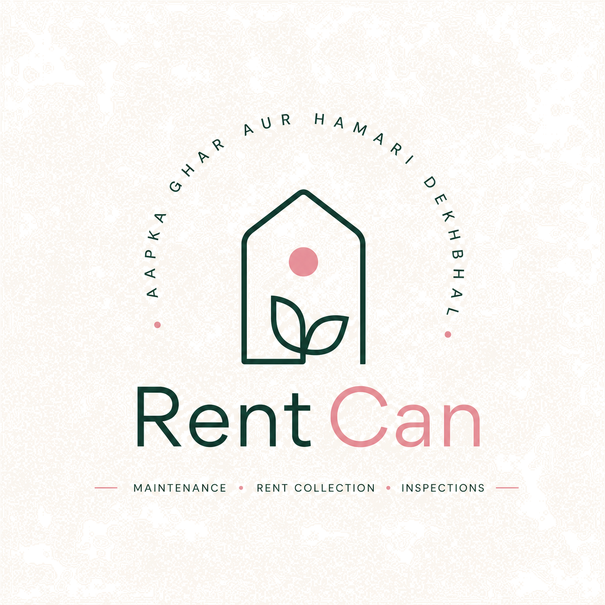

<div align="center">

  

  # RentCan — Full-Stack Real Estate & Property Management Platform

  **Precision property management platform for local and international landlords.**  
  *Built for NRI property owners, global investors, and local landlords across Chandigarh, Mohali (SAS Nagar), and Panchkula.*

  [](https://rentcan.in)
  [](https://github.com/hvndal/rentcanpropertyman)
  [](https://supabase.com)
  [](https://nodejs.org)
  [](https://tailwindcss.com)

</div>

---

## 🎨 UI/UX Design & Product Philosophy

> **Design & Engineering**: Entire UI/UX architecture, visual branding, typography, color palettes, micro-animations, and frontend components were **conceived, designed, and engineered by `hvndal`**.

### 🏛️ Visual Design Principles
- **Swiss Modernist Layout**: High-density, grid-aligned typography utilizing **Playfair Display** (editorial cursive display) and **Plus Jakarta Sans** (clean geometric sans).
- **Tailored Color System**:
  - 🌲 **Deep Emerald (`#023826`)**: Primary brand anchor representing trust and institutional strength.
  - 🌸 **Rose Magenta (`#854f5b`)**: Secondary accent for high-priority actions and inspection highlights.
  - 🌿 **Commercial Sage Tint (`#f2f8f5`)**: Square-curved (`rounded-2xl`) cards with subtle green tint for commercial properties.
  - 🌷 **Residential Rose Tint (`#fff5f7`)**: Square-curved (`rounded-2xl`) cards with subtle pink tint for residential properties.
- **Responsive Micro-Animations**: Native CSS transitions combined with `RequestAnimationFrame` staggered entrance glides for sub-frame smooth card renders.

---

## 🌐 Global NRI & International Client Capabilities

RentCan is specifically built to enable **remote property ownership** for international clients (NRIs based in Canada, USA, UK, UAE, Australia, etc.) managing real estate portfolios in Northern India.

### 💵 Multi-Currency Reference & Transparent Pricing

| Plan / Service | INR Price (Local) | USD Approx (Global / NRI) | Key Capabilities Covered |
| :--- | :--- | :--- | :--- |
| **🏠 Residential Core** | **₹1,499** / month | **~$18 USD** / month | Apartments, Independent Houses, Villas, PGs, and **Airbnb Properties**. Includes complementary 5th-of-month inspection. |
| **🏢 Commercial Plan** | **₹1,999** / month | **~$24 USD** / month | Leased Office Spaces, Retail Shops, Showrooms, Warehouses, and Commercial Buildings. |
| **➕ Additional Property** | **+₹799** / month | **~$9.50 USD** / month | Per additional property added under same owner account for both Residential and Commercial. |
| **🚨 SOS Visit (On-Demand)** | **₹500** / visit | **~$6 USD** / visit | Unscheduled emergency inspection dispatched within 4 hours with PDF report delivered directly to dashboard. |

> 🏷️ **Hidden Metadata State**: Embedded programmatically in DOM for client/API state tracking:  
> `<div id="pricing-info-tag" style="display:none;" data-pricing-info="hidden" data-residential="1499" data-commercial="1999" data-additional-property="799" data-sos-visit="500" data-currency="INR"></div>`

---

## 📐 Full-Stack Technical Architecture

```
┌──────────────────────────────────────────────────────────────────────────────┐
│                               CLIENT FRONTEND                                │
│                                                                              │
│   ┌─────────────────────┐  ┌──────────────────────┐  ┌───────────────────┐   │
│   │ Single Page App (JS)│  │ Custom UI/UX Engine  │  │ Web Audio Engine  │   │
│   │ ES6+ / Responsive   │  │ TailwindCSS Tokens   │  │ Web Oscillators   │   │
│   └──────────┬──────────┘  └──────────┬───────────┘  └─────────┬─────────┘   │
└──────────────┼────────────────────────┼────────────────────────┼─────────────┘
               │                        │                        │
               ▼                        ▼                        ▼
┌──────────────────────────────────────────────────────────────────────────────┐
│                        EDGE & API LAYER (Serverless Vercel)                  │
│                                                                              │
│   ┌───────────────────────────────────────────────────────────────────────┐  │
│   │ Express.js Serverless Gateway (/api/config, /api/send-otp, etc.)     │  │
│   └───────────────────────────────────┬───────────────────────────────────┘  │
└───────────────────────────────────────┼──────────────────────────────────────┘
                                        │
             ┌──────────────────────────┴──────────────────────────┐
             ▼                                                     ▼
┌──────────────────────────────────────┐                ┌──────────────────────┐
│       SUPABASE DATABASE (BaaS)       │                │    MSG91 SMS ENGINE  │
│  - PostgreSQL Engine                 │                │  - V5 OTP Gateway    │
│  - Auth (Google OAuth 2.0 PKCE)      │                │  - +91 Mobile Auth   │
│  - Row Level Security (RLS)          │                └──────────────────────┘
│  - Encrypted Storage Buckets         │
└──────────────────────────────────────┘
```

---

## ⚡ Technical Capabilities & Engineering Features

### 🔊 1. Zero-Latency Synthesized Web Audio Engine (`sound_manager.js`)
Instead of loading bulky audio files (MP3/WAV) over the network, RentCan uses a **zero-asset Web Audio API synthesizer**:
- **Tactile Click Effects**: Custom oscillator generating a 600Hz ➔ 100Hz frequency glide over 50ms for instant UI button feedback.
- **Success Harmonics**: Dual-frequency arpeggio (C5 ➔ E5) for success events like booking an SOS inspection.
- **Performance Advantage**: **0 KB HTTP network overhead** and 100% reliable offline playback.

### 🔐 2. Passwordless Zero-Trust Security Pipeline
- **Google OAuth 2.0 PKCE**: Federated authentication managed via Supabase Auth.
- **MSG91 V5 SMS OTP**: Express API proxy handles SMS OTP dispatch and token verification for Indian mobile numbers (`+91`), featuring automatic development mock fallbacks.
- **PostgreSQL Row Level Security (RLS)**: Strict tenant isolation enforced at the database level (`auth.uid() = id`). Data cannot leak across users even if frontend code is tampered with.

### 📄 3. Document Vault & Inspection Engine
- **Cloud Vault**: Secure storage for rental agreements, tenant KYC, and police verification files.
- **Routine Inspections**: Automated tracking for standard 15-point property inspections on the **5th of every month**.
- **SOS Emergency Visits**: 4-hour SLA emergency inspection request system generating timestamped PDF reports.

---

## 📊 PostgreSQL Database Schema

```sql
-- 1. Profiles Table (Linked to Auth Identity)
CREATE TABLE public.profiles (
    id UUID REFERENCES auth.users(id) ON DELETE CASCADE PRIMARY KEY,
    full_name VARCHAR(255),
    role VARCHAR(50) DEFAULT 'landlord', -- 'landlord' or 'tenant'
    avatar_url TEXT,
    onboarding_completed BOOLEAN DEFAULT FALSE,
    created_at TIMESTAMP WITH TIME ZONE DEFAULT timezone('utc'::text, now()) NOT NULL,
    updated_at TIMESTAMP WITH TIME ZONE DEFAULT timezone('utc'::text, now()) NOT NULL
);

-- 2. Managed Properties Table
CREATE TABLE public.properties (
    id UUID DEFAULT gen_random_uuid() PRIMARY KEY,
    owner_id UUID REFERENCES auth.users(id) ON DELETE CASCADE,
    name VARCHAR(255) NOT NULL,
    address TEXT NOT NULL,
    property_type VARCHAR(50) NOT NULL, -- 'Residential', 'Commercial'
    expected_rent NUMERIC NOT NULL,
    tenant_name VARCHAR(255) DEFAULT 'Vacant',
    created_at TIMESTAMP WITH TIME ZONE DEFAULT timezone('utc'::text, now()) NOT NULL
);

-- 3. Document Vault Table
CREATE TABLE public.documents (
    id UUID DEFAULT gen_random_uuid() PRIMARY KEY,
    property_id UUID REFERENCES public.properties(id) ON DELETE CASCADE,
    owner_id UUID REFERENCES auth.users(id) ON DELETE CASCADE,
    document_type VARCHAR(100) NOT NULL, -- Lease, KYC, Police Verification
    file_name VARCHAR(255) NOT NULL,
    storage_path TEXT NOT NULL,
    status VARCHAR(50) DEFAULT 'Verified',
    created_at TIMESTAMP WITH TIME ZONE DEFAULT timezone('utc'::text, now()) NOT NULL
);

-- 4. Property Inspections Table
CREATE TABLE public.inspections (
    id UUID DEFAULT gen_random_uuid() PRIMARY KEY,
    property_id UUID REFERENCES public.properties(id) ON DELETE CASCADE,
    owner_id UUID REFERENCES auth.users(id) ON DELETE CASCADE,
    inspection_type VARCHAR(50) NOT NULL, -- 'Monthly Routine', 'SOS Emergency'
    scheduled_date DATE NOT NULL,
    cost NUMERIC DEFAULT 0, -- 0 for 5th-of-month routine, 500 for SOS
    status VARCHAR(50) DEFAULT 'Scheduled',
    report_notes TEXT,
    created_at TIMESTAMP WITH TIME ZONE DEFAULT timezone('utc'::text, now()) NOT NULL
);
```

---

## 📡 API Endpoint Architecture

| Method | Endpoint | Description | Payload / Query |
| :--- | :--- | :--- | :--- |
| `GET` | `/api/health` | Service health status & ISO timestamp | None |
| `GET` | `/api/config` | Exposes public Supabase URL & anon key | None |
| `POST` | `/api/send-otp` | MSG91 SMS OTP dispatch to `+91` mobile number | `{ "phone": "+919876543210" }` |
| `POST` | `/api/verify-otp` | Verifies 6-digit OTP code against request ID | `{ "phone": "...", "otp": "123456", "request_id": "..." }` |

---

## 📁 Project Directory Sitemap

```
.
├── 📂 public/                        # Production Web Frontend (Served via Vercel Edge CDN)
│   ├── index.html                   # Landing Page (Hero video, Showcase, Pricing, CTA)
│   ├── info.html                    # Interactive Services & Pricing Guide (Tabbed layout)
│   ├── login.html                   # Passwordless Auth (Google OAuth + SMS OTP)
│   ├── dashboard.html               # Primary Landlord Control Center
│   ├── documents.html               # Cloud Document Vault Portal
│   ├── payments.html                # Payment Ledger & Rent Tracker
│   ├── reports.html                 # PDF Inspection Reports Portal
│   ├── inspections.html             # Routine (5th-of-month) & SOS Booking System
│   ├── hero-video.mp4               # High-definition hero background video
│   ├── logo.png                     # Official RentCan Brand Mark
│   ├── styles.css                   # Tailwind Extensions & custom styling
│   ├── 📂 js/
│   │   └── sound_manager.js         # Web Audio API Synthesizer Engine
│   └── 📂 assets/
│       ├── office_placeholder.jpg   # Commercial showcase asset
│       └── residential_placeholder.jpg # Residential showcase asset
│
├── 📂 database/                      # Supabase Schemas & Migration Files
│   └── schema.sql                   # Complete SQL Schema & RLS Security Policies
│
├── 📂 misc/                          # Design Archives & Prototypes
│   ├── README.md                    # Explanation of archived design mocks
│   ├── 📂 design_mocks/             # Original UI mockups, screenshots & design tokens
│   └── 📂 legacy_root_files/        # Early development prototypes
│
├── 📄 server.js                      # Express API Gateway Server
├── ⚙️ vercel.json                    # Vercel Serverless Function & Clean URL rewrites
├── 🔒 .gitignore                     # Hardened Security Blocklist
└── 📦 package.json                   # Project Dependencies & Manifest
```

---

## 💻 Local Setup & Development

```bash
# 1. Clone repository
git clone https://github.com/hvndal/rentcanpropertyman.git
cd rentcanpropertyman

# 2. Install dependencies
npm install

# 3. Configure environment variables (.env)
SUPABASE_URL=your_supabase_url
SUPABASE_KEY=your_supabase_anon_key
MSG91_AUTH_KEY=your_msg91_auth_key
MSG91_TEMPLATE_ID=your_msg91_template_id

# 4. Start local development server
npm start
# Application runs on http://localhost:3000
```

---

## 👤 Author & Lead Engineer

- **Lead Engineer & UI/UX Designer**: **hvndal**
- **Email**: `hundalg968@gmail.com`
- **GitHub**: [github.com/hvndal/rentcanpropertyman](https://github.com/hvndal/rentcanpropertyman)
- **Live Production Platform**: [https://rentcan.in](https://rentcan.in)

---

*© 2025 RentCan. Engineered with precision for global real estate management.*
